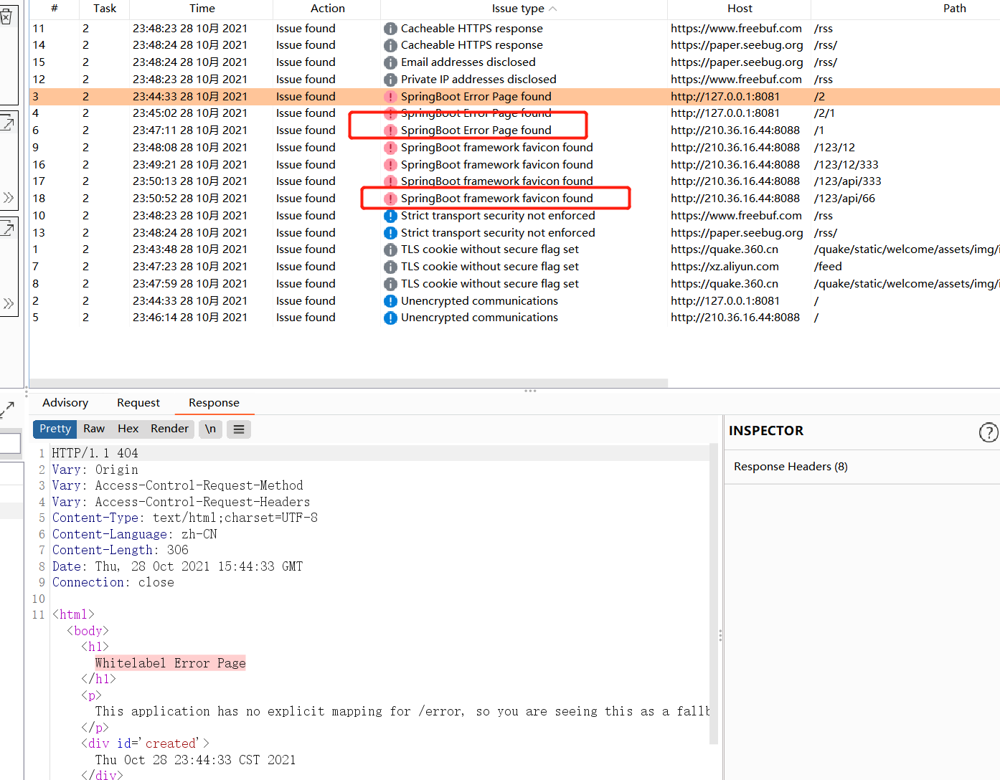
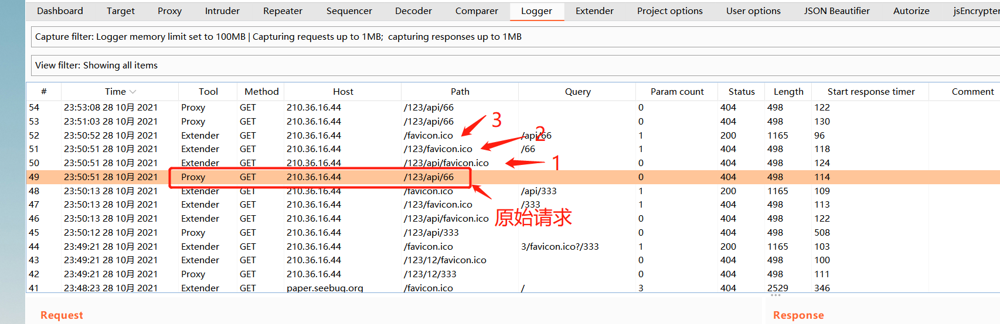

# SpringBootFinder 
***


## burp插件实现被动探测SpringBoot 框架 基于以下两点实现
>- 递归遍历 urlpath 替换成favicon 再次请求,判断响应body是不是绿色叶子图标
>- 如果404 页面有 "Whitelabel Error Page" 也会提示

效果如下图所示


缺点就是 同一个host 下如果请求了不同的路径，都报错的话,会重复
***
原理就是 递归遍历urlpath 分别替换成favicon.ico 进行请求，然后获取响应体body 在求 散列值和shodan和fofa的算法一样

```java
        String OldReq = helpers.bytesToString(baseRequestResponse.getRequest());
        String Rurl = helpers.analyzeRequest(baseRequestResponse).getUrl().getPath();
        String[] strlist = Rurl.split("/");
        if (strlist.length < 1) {
            return null;
        }
        for (int i = strlist.length - 1; i > 0; i--) { // 反转 path 从后
            if (!"".equals(strlist[i])) {
                NewReq = OldReq.replace(strlist[i], "favicon.ico?");
                IHttpRequestResponse checkRequestResponse = callbacks.makeHttpRequest(baseRequestResponse.getHttpService(), helpers.stringToBytes(NewReq));
                //IResponseInfo oresponse可以获取body的getBodyOffset()
                byte[] res = checkRequestResponse.getResponse();
                oresponse = helpers.analyzeResponse(res); //
                //IHttpRequestResponse 返回的byte[] response
                ores = new String(res);
                oResBodyInfo = ores.substring(oresponse.getBodyOffset());
                byte[] destResponse;
                destResponse = Arrays.copyOfRange(res, oresponse.getBodyOffset(), res.length);
                if (destResponse != null) {
                    if (isSpringBoot(destResponse)) {
                        issues.add();                        
                    }
                }
            }
```
求图标 散列值
```java
  // 判断响应包的图标是不是spring
    public boolean isSpringBoot(byte[] destResponse) {
        String base64Str = Base64.getMimeEncoder().encodeToString(destResponse);
        int favicon = Hashing.murmur3_32().hashString(base64Str.replace("\r", "") + "\n", StandardCharsets.UTF_8).asInt();
        if (116323821 == favicon) {
            return true;
        } else return false;
    }

```

***
# V2 版本去除冗余代码，优化逻辑，提升性能
优化图标重复漏洞问题，但目录报错还是会重复

